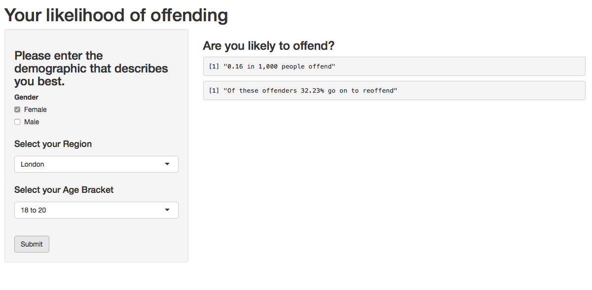

## How likely are you to offend?

In order to assess this question, the Proven Reoffending Statistics, which was released in July 2016 by the Ministry of Justice, GB. The data set used was the CSV format of data tools, found at this link:

https://www.gov.uk/government/statistics/proven-reoffending-statistics-october-2013-to-september-2014

The dataset contains a breakdown of the offending and reoffending data in the period October 2013 to September 2014 by the following characteristics:

1. Age
2. Area
3. Gender

--- .class #id 

## How likely are you to offend?

The dataset was cleaned to contain only the breakdown by area, age and gender.

Then the population of each area of England and Wales in 2014 was obtained from the Office for National Statistics (ONS) Annual Mid-year Population Estimates. These can be found at the following link:

http://www.ons.gov.uk/peoplepopulationandcommunity/populationandmigration/populationestimates/bulletins/annualmidyearpopulationestimates/2015-06-25


```{r, results='asis', echo=FALSE, warning=FALSE}
library(xtable)
x <- as.data.frame(cbind(c("North East", "North West", "South East", "South West", "London"), c("8,100,00", "7,800,000", "18,700,000", "14,500,000", "9,100,000")))
names(x) <- c("Region", "Population Estimate")
print(xtable(x), type = "html")
```

--- .class #id 

## How likely are you to offend?

# The user can then input their Gender, Age and Area of choice.

Imagine you are a female from London, with the age range 18 to 20. You would input those details in the left hand panel and then press submit to get the likelihood of you offending.




In the background, the proportion of offenders in these sub-categories is calculated and the number of offenders in 1,000 is provided, after pressing "Submit".


--- .class #id 

## How likely are you to offend?

# Output of the product


The output given is the number of offenders in 1,000 individuals who all have the same age, gender and area as the submitted entries. Further, the risk of reoffence is provided too.

Two plots are given that show the breakdown offences committed by offence category in the age, gender and area categories and the number of previous offences commited by the same individuals.


``` {r echo = FALSE, fig.height = 4, fig.width = 14, fig.align = 'center', message = F}
library(ggplot2)
library(grid)
library(gridExtra)
no.off <- read.table("/Users/Angelina/DataScience/coursera/building_ds_tool/shinyapp/number_offences.txt", sep=",")
type.off <- read.table("/Users/Angelina/DataScience/coursera/building_ds_tool/shinyapp/type_offences.txt", sep=",")

gender <- "Female"
selectage <- "18 to 20"
selectarea <- "London"

group <- ifelse(gender == "Male", 7, 8)
forplot <- subset(no.off, area == selectarea & age.group == selectage)
g1 <- ggplot(forplot, aes(value, forplot[,group], fill = forplot[,group])) + geom_bar(stat="identity") + theme(legend.position="none", text = element_text(size=14), axis.text.x = element_text(angle=45, vjust = 0.9, hjust = 1)) + ylab("Number of Offenders") + xlab("Number of Offences") + ggtitle("The Number of Offences Previously Committed")
forplot2 <- subset(type.off, area == selectarea & age.group == selectage)
g2 <- ggplot(forplot2, aes(value, forplot2[,group], fill = forplot2[,group])) + geom_bar(stat="identity") + theme(legend.position="none", text = element_text(size=14), axis.text.x = element_text(angle=45, vjust = 0.9, hjust = 1)) + ylab("Number of Offenders") + xlab("Types of Offences") + ggtitle("The Types of Offences Committed")
grid.arrange(g1, g2, ncol = 2)
```
